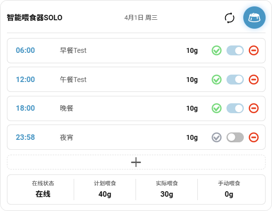

# PetKit 喂食器 Home Assistant 集成

[](https://github.com/hacs/integration)

Home Assistant 原生集成，支持小佩智能喂食器的完整控制。

## 卡片预览



## 功能

- **喂食计划管理** - 新增/删除/修改计划，自动同步一周
- **喂食历史记录** - 追踪每次喂食详情
- **手动喂食** - 一键出粮
- **状态监控** - 在线状态、WiFi 信号、干燥剂状态
- **美观卡片** - 专为 Lovelace 设计的可视化界面

## 安装

### HACS 安装（推荐）

1. HACS → 集成 → 探索并下载仓库
2. 搜索 "Petkit Feeder"
3. 点击下载并重启 Home Assistant
4. 设置 → 设备与服务 → 添加集成 → 搜索 "小佩"

### 手动安装

1. 将 `custom_components/petkit_feeder` 复制到 Home Assistant 的 `custom_components` 目录
2. 将 `petkit_feeder_card/dist/petkit-feeder-card.js` 复制到 `www` 目录
3. 重启 Home Assistant
4. 设置 → 设备与服务 → 添加集成 → 搜索 "小佩"

## Lovelace 卡片

```yaml
type: custom:petkit-feeder-card
device_id: "276669"
```

## 鸭谢

本项目基于 [py-petkit-api](https://github.com/Jezza34000/py-petkit-api) 开发，感谢原作者的贡献。

## 注意

- 本项目非小佩官方产品
- API 可能随时变更